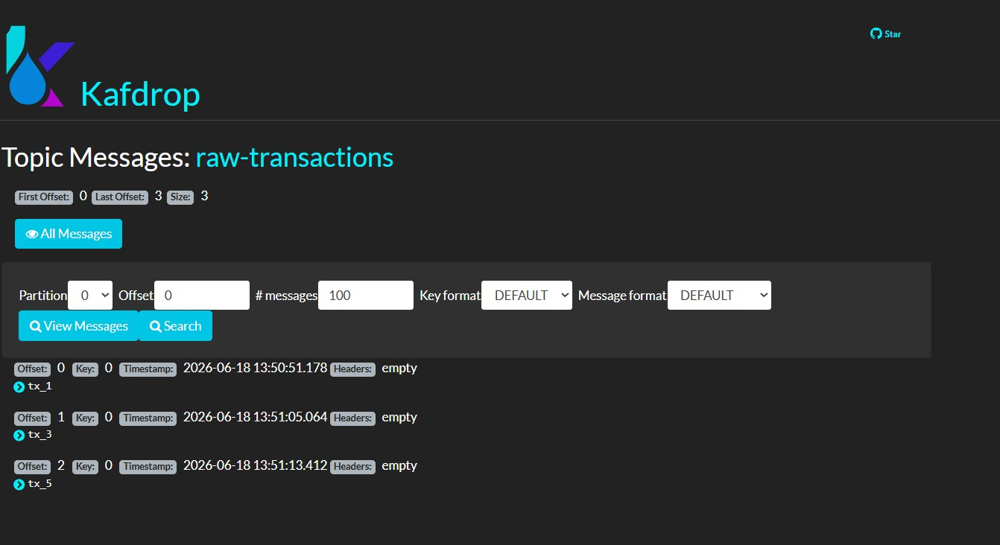
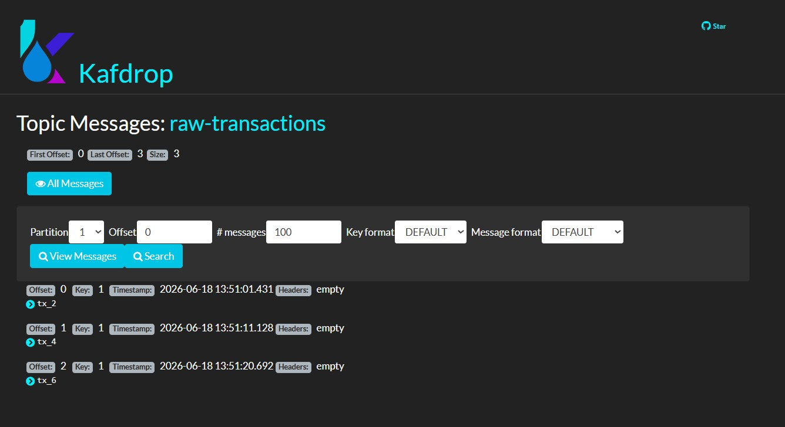
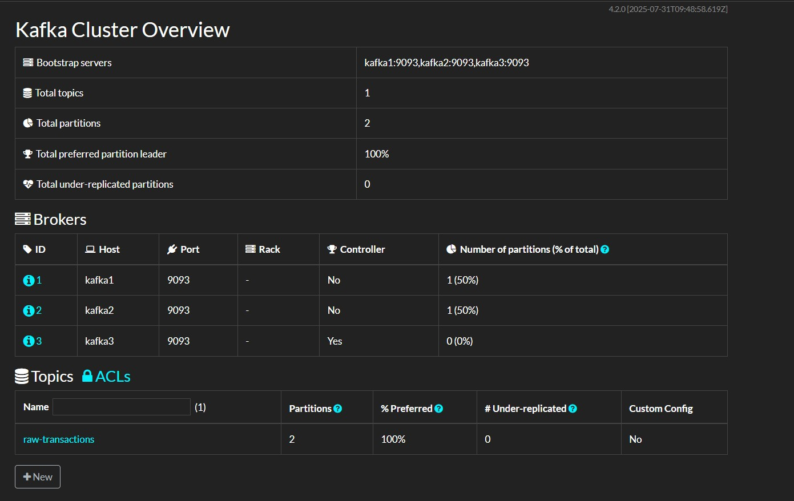

# Kafka Day 1 Lab — Real-Time Pipeline Scaling & Replay

**Author:** Mohammed Refai  
**GitHub:** [mohammedrefai20](https://github.com/mohammedrefai20)  
**Course:** Kafka — ITI

---

## Lab Scenario

You are a Data Engineer building a real-time ingestion pipeline for a bank. Transactions are flooding into the cluster, and you need to deploy a scalable, fault-tolerant consumer group to process both historical logs and live data streams in parallel.

---

## Environment

- **Docker Compose** with 3 Kafka brokers running in KRaft mode (no ZooKeeper)
- **Kafdrop UI** for visual cluster monitoring
- **Apache Kafka 4.0.0**

### Cluster Architecture

| Container | Role | Port |
|---|---|---|
| kafka1 | Broker + Controller | 9092 |
| kafka2 | Broker + Controller | 9095 |
| kafka3 | Broker + Controller | 9096 |
| kafdrop | UI Dashboard | 9002 |

---

## How to Run

```bash
docker compose up -d
```

Verify all containers are running:

```bash
docker compose ps
```


---

## Lab Tasks

### Task 1: Create the Topic

Created the `raw-transactions` topic with 2 partitions and replication factor 3 across all brokers.

```bash
docker exec -it kafka1 /opt/kafka/bin/kafka-topics.sh --create --topic raw-transactions --bootstrap-server kafka1:9093 --partitions 2 --replication-factor 3
```

Verify the topic:

```bash
docker exec -it kafka1 /opt/kafka/bin/kafka-topics.sh --describe --topic raw-transactions --bootstrap-server kafka1:9093
```


---

### Task 2: Start the Producer

Started a console producer with key-based routing to ensure even message distribution across partitions.

```bash
docker exec -it kafka1 /opt/kafka/bin/kafka-console-producer.sh --topic raw-transactions --bootstrap-server kafka1:9093 --property parse.key=true --property key.separator=:
```

Sent 6 historical messages:

```
0:tx_1
1:tx_2
0:tx_3
1:tx_4
0:tx_5
1:tx_6
```

- Key `0` → Partition 0 → `tx_1, tx_3, tx_5`
- Key `1` → Partition 1 → `tx_2, tx_4, tx_6`


---

### Task 3: Parallel Consumer Group — Load Balancing Test

Launched 2 consumers in the same group `fraud-analysis-team` with `--from-beginning` to replay all historical messages.

```bash
docker exec -it kafka1 /opt/kafka/bin/kafka-console-consumer.sh --topic raw-transactions --bootstrap-server kafka1:9093 --group fraud-analysis-team --from-beginning
```

Kafka automatically split the partitions between the two consumers:

- Consumer 1 → Partition 0 → `tx_1, tx_3, tx_5`
- Consumer 2 → Partition 1 → `tx_2, tx_4, tx_6`





---

### Task 4: Crash & Recovery Simulation

Forcefully shut down Consumer 2 then sent 3 new live messages from the producer:

```
0:tx_7
1:tx_8
0:tx_9
```

Consumer 1 automatically detected the failure, took over Partition 0, and received all 3 new messages with zero message loss.

Kafdrop confirmed `fraud-analysis-team` consumer group lag = **0**, meaning no messages were missed.


---

## Kafdrop UI

Kafdrop provided a visual dashboard to monitor the cluster, topic partitions, replicas, and consumer group lag in real time. Accessible at `localhost:9002`.




---

## Key Concepts Demonstrated

| Concept | What Was Proved |
|---|---|
| Partitioning | Messages routed by key to specific partitions |
| Consumer Group | 2 consumers split partitions automatically |
| Replay | `--from-beginning` replayed all historical messages |
| Fault Tolerance | Surviving consumer took over crashed consumer's partition |
| Replication | Each partition copied across all 3 brokers |
| Zero Message Loss | Consumer group lag = 0 after crash and recovery |

---

## Screenshots

All screenshots are located in the `screenshots/` folder.

| Screenshot | Description |
|---|---|
| Docker Launch | All 4 containers running via docker compose |
| Docker containers | docker compose ps output |
| Create the Topic | Topic created with 2 partitions and replication factor 3 |
| Producer Terminal | Producer sending keyed messages |
| Load balancing | Both consumers receiving split messages |
| Partition_0 | Consumer assigned to Partition 0 |
| Partition_1 | Consumer assigned to Partition 1 |
| Kafdrop | Kafdrop UI showing cluster overview |
| Topic raw-transactions | Topic details in Kafdrop |
| Crash & Recovery Simulation | Consumer 1 taking over after Consumer 2 crash |
| Crash & Recovery Simulation_1 | Kafdrop showing lag = 0 after recovery |